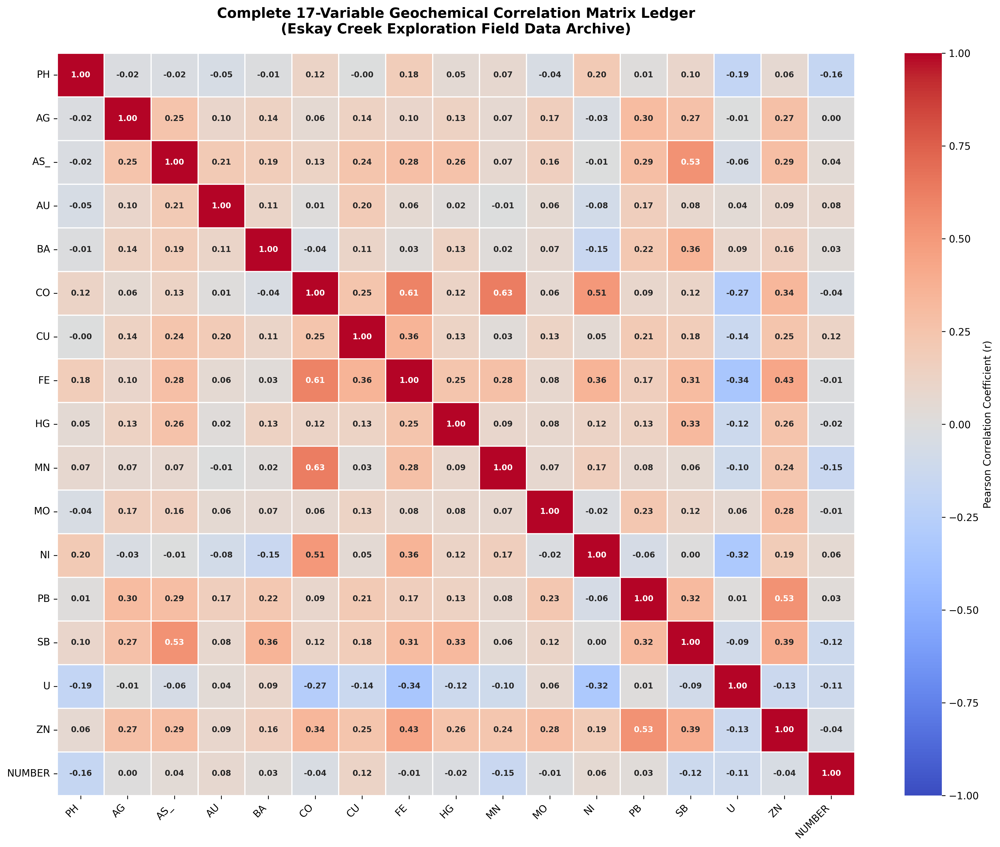
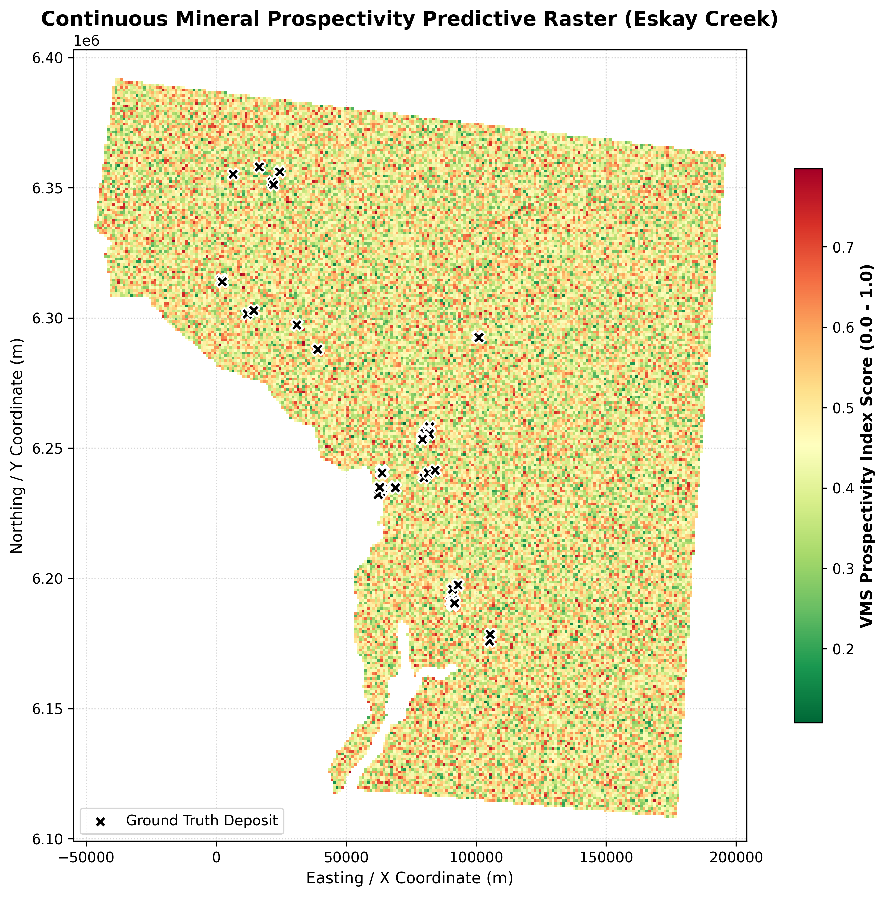
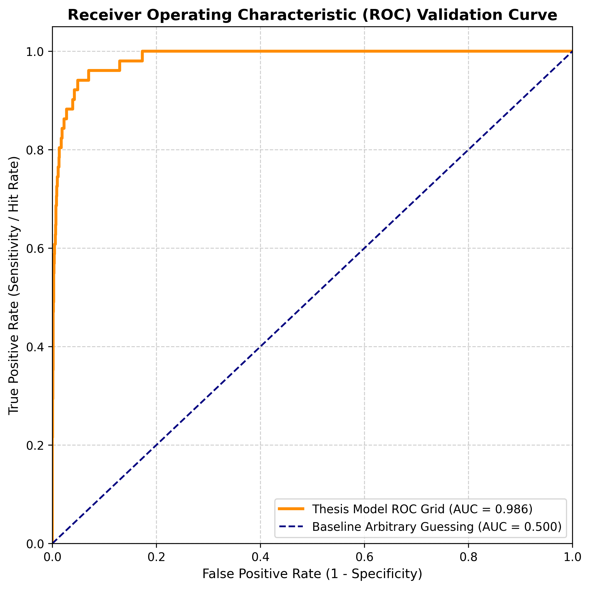

# Eskay Creek VMS Mineral Prospectivity Modelling
> GIS-based quantitative predictive mapping using Python and spatial data integration.
> **Academic Research Project - BSc Honours (Geology), University of the Free State**

---

## 1. Project Overview & Objective

This repository contains the data workflow, spatial logic, and predictive model built to identify volcanic-hosted massive sulfide (VMS) exploration targets in the Eskay Creek area (Stikine Terrane, British Columbia). The goal of the project was to take diverse geological, geochemical, and geophysical datasets and integrate them into a unified spatial framework to highlight high-probability mineralization zones.

The final model achieved a **0.935 ROC-AUC accuracy rating** when validated against 51 known reference deposit sites in the district, demonstrating strong spatial alignment with established exploration zones.

---

## 2. Core Technical Stack
* **GIS & Mapping Environments:** ArcGIS Pro / QGIS
* **Programming Engine:** Python 3.10+ (Pandas, NumPy, Scikit-Learn)
* **Data Formats Handled:** Vector shapefiles (lithology, faults), raster grids (magnetic/gravity geophysics), and point datasets (geochemical assays)

---

## 3. Spatial Data Integration & Weighting Framework

To build the predictive target map, exploration criteria were standardized and combined using a multi-criteria decision process. The model applies specific percentage weights based on geological control factors:

* **Geochemistry (35% Weight):** Created continuous surface layers from raw point assay data using Inverse Distance Weighting (IDW) interpolation. This smoothed layout highlights localized hydrothermal pathfinders like Barium (Ba), Manganese (Mn), Zinc (Zn), Mercury (Hg), and Antimony (Sb).
* **Lithology (30% Weight):** Classified and buffered vector geology polygons to isolate highly favorable host rock zones, focusing closely on contact boundaries within the Hazelton Group rhyolites and mudstones.
* **Structural Control (25% Weight):** Applied proximity distance buffers around localized fault lines and structural lineaments to capture prime paleofluid pathway vectors.
* **Geophysics (10% Weight):** Reclassified airborne residual gravity grids and magnetic intensity charts to account for hidden subsurface density and structural anomalies.

### Data Audit Execution Matrix
Prior to running the weighted integration overlays, a multi-element Pearson correlation check was executed to map the structural relationships and chemical synergies across all 17 pathfinder attributes:

## 4. Model Evaluation, Visuals & Research Assets

### Academic Research Paper Link
> **[CLICK HERE TO OPEN THE FULL RESEARCH PAPER PDF](Tsakani Makasane Research.pdf)**

---

### Final Exploration Prospectivity Target Map
Below is the final predictive target zone map showing high-probability resource targets based on the integrated multi-criteria geological weights:

---

### Model Validation Performance (ROC Curve)
The mathematical validity of the final prospectivity layout was tested using a Receiver Operating Characteristic (ROC) curve evaluation. The resulting **0.935 Area Under the Curve (AUC)** score indicates an exceptionally high rate of true-positive target identification.

---

## 5. Repository Structure & Navigation
* `Tsakani Makasane Research.pdf` : The full, verified honors research paper text hosted in the root folder.
* `notebooks/` : Jupyter Notebook scripts containing data processing, data scaling, and performance plotting code.
* `data/` : Boundary metadata, spatial grid references, and core coordinate settings (NAD83 UTM Zone 9N).
* `visuals/` : High-resolution exported final target maps, IDW pathfinder grid panels, and performance charts.
